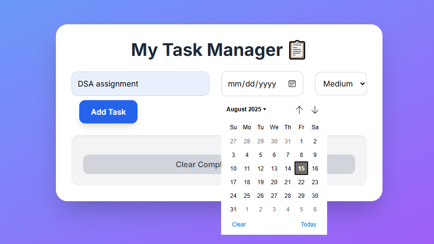

-----

### The Problem: A Mismatch in the Filename

File paths are very specific and must match the actual filename exactly.

  * Your actual files (seen on the left side of your screenshot) are named Screenshot_1.png and Screenshot_2.png (using an underscore).
  * Your Markdown code is trying to link to files with a space in the name (Screenshot _1.png), which don't exist.

Additionally, some of your other links and formatting could be improved for better presentation.

-----

### The Solution

Here is the corrected and fully formatted version of your README.md file. Simply copy all the code below and paste it into your README file on GitHub.

markdown
# Task Manager Pro

A dynamic and responsive task management application built with pure JavaScript, HTML, and CSS. This project empowers users to add, edit, and organize their tasks with a modern and intuitive user interface.

🚀 *Live Demo:* [View Project: Task Manager Pro Live](https://chouhanhimanshi777-lang.github.io/my-task-manager/)

***

## ✨ Key Features

* *📝 Task Management:* Easily add, edit, and delete tasks with a single click.
* *✅ Completion Tracking:* Mark tasks as complete to monitor your progress and keep your list tidy.
* *💾 Persistent Storage:* All tasks are automatically saved to your browser's local storage, so your data is never lost on refresh.
* *🗓 Smart Date Reminders:* Tasks are visually highlighted based on their due date, ensuring you never miss a deadline.
* *🎨 Priority Indicators:* Color-coded borders (High, Medium, Low) help you quickly identify important tasks.
* *🗑 Clear Completed:* A dedicated button allows you to clear all completed tasks at once.
* *📱 Fully Responsive:* The user interface is optimized for a seamless experience on all devices, from mobile phones to desktops.

***

## 🖼 Screenshots

### 📌 Home Dashboard

A clean and modern dashboard showing task summary, quick add option, and statistics.

### 📌 Adding a New Task

An intuitive form for adding tasks with priority, due date, and descriptive details.

***

## 🛠 Technology Stack

* *HTML5:* The foundation for the application's structure.
* *CSS3:* Custom styling and animations for a polished look.
* *Tailwind CSS:* A utility-first framework for rapid and responsive UI development.
* *JavaScript (ES6+):* Powers all core functionality and user interaction.
* *Font Awesome:* Provides the icons used for task actions.

***

## 📂 Project Structure

task-manager-pro/
├── index.html                     \# Main HTML structure
├── styles.css                       \# CSS styling and responsive design
├── script.js                         \# JavaScript functionality
├── assets/                          \# Images and screenshots
│   ├── Screenshot\_1.png
│   └── Screenshot\_2.png
└── README.md                 \# Project documentation

`

***

## 🚀 Getting Started

To get a local copy of this project up and running on your machine, follow these simple steps.

1.  *Clone the repository:*
    bash
    git clone [https://github.com/chouhanhimanshi777-lang/my-task-manager.git](https://github.com/chouhanhimanshi777-lang/my-task-manager.git)
    
2.  *Open the project:*
    Navigate to the project folder and simply open the index.html file in your preferred web browser.

***

## 👤 Author

* *GitHub:* [@chouhanhimanshi777-lang](https://github.com/chouhanhimanshi777-lang)
* *LinkedIn:* [Himanshi Chouhan](https://www.linkedin.com/in/himanshi-chouhan-69180a339/)
`
