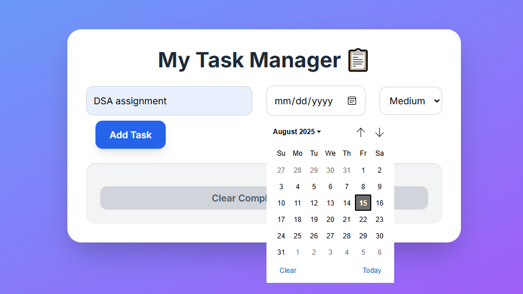

Task Manager ProA dynamic and responsive task management application built with pure JavaScript, HTML, and CSS. This project empowers users to add, edit, and organize their tasks with a modern and intuitive user interface.🚀 Live DemoView Project: Task Manager Pro Live
## 🖼 Screenshots

### 📌 Home Dashboard

A clean and modern dashboard showing task summary, quick add option, and statistics.

### 📌 Adding a New Task

Intuitive form for adding tasks with priority, due date, and descriptive details.
A clean and modern dashboard showing task summary, quick add option, and statistic
Intuitive form for adding tasks with priority, due date, and descriptive details.
✨ Key Features📝 Task Management: Easily add, edit, and delete tasks with a single click.✅ Completion Tracking: Mark tasks as complete to monitor your progress and keep your list tidy.💾 Persistent Storage: All tasks are automatically saved to your browser's local storage, so your data is never lost on refresh.🗓️ Smart Date Reminders: Tasks are visually highlighted based on their due date, ensuring you never miss a deadline.🎨 Priority Indicators: Color-coded borders (High, Medium, Low) help you quickly identify important tasks.🗑️ Clear Completed: A dedicated button allows you to clear all completed tasks at once.📱 Fully Responsive: The user interface is optimized for a seamless experience on all devices, from mobile phones to desktops.🛠️ Technology StackHTML5: The foundation for the application's structure.CSS3: Custom styling and animations for a polished look.Tailwind CSS: A utility-first framework for rapid and responsive UI development.JavaScript (ES6+): Powers all core functionality and user interaction.Font Awesome: Provides the icons used for task actions.🚀 Getting StartedTo get a local copy of this project up and running on your machine, follow these simple steps.Clone the repository:git clone https://github.com/chouhanhimanshi777-lang/my-task-manager.git

Open the project: Simply open the index.html file in your preferred web browser.👤 AuthorGitHub: @chouhanhimanshi777-lang
